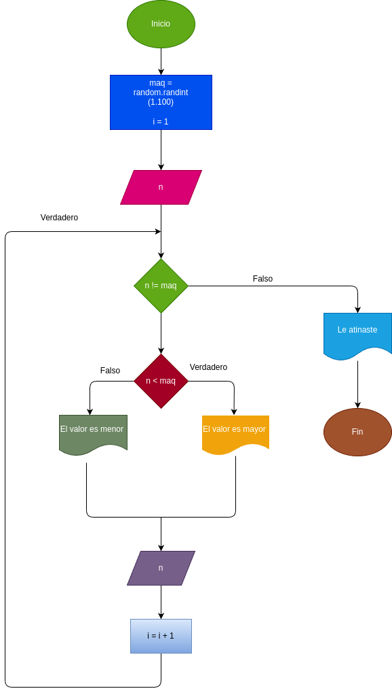

# While_3
Este es un simple juego en el que el usuario debe adivinar un numero aletorio generado por la computadora. El juego proporciona pistas para guiar al usuario hasta que logre adivinar el numero  correctamente.

## input

### Varibles de entrada
n: numeros que desea ingresar 
### processing 
maq: La computadora genera un numero aletorio entre 1 y 100.

i: lleva el control de la cantidad de intentos del usuario.

mientras n < maq:

Si el numero ingresado es menor que el numero generado, el programa indica que el numero a adivnar es mayor.

Si el numero ingresado es mayor que el numero generado, el programa indica que el numero a adivinar es menor.

Volver a pedir un valor y suma 1 intento 

### output
Depende el resultado sera la respuesta
# Diseño 

# Construccion